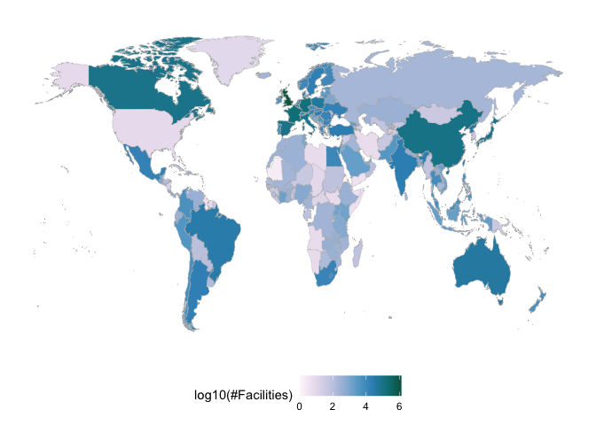

<!-- README.md is generated from README.Rmd. Please edit that file -->

# bis620.2023

<!-- badges: start -->

[](https://github.com/kaneplusplus/bis620.2023/actions/workflows/R-CMD-check.yaml)
<!-- badges: end -->

The goal of bis620.2023 is to build a package with a shiny app.

## Installation

You can install the development version of bis620.2023 from
[GitHub](https://github.com/) with:

``` r
# install.packages("devtools")
devtools::install_github("anranjiao/bis620.2023")
```

## Description

This package includes a shiny app based on a dataset from clinical trial provided by ClinicalTrails.gov. This app offers multiple functions for users such as identifying the distribution of facilities over the world, eligibility criteria for each study, and the types and counts of diseases studied which help the users better understand the past clinical trials through various ways of visualizations.


## Example

This is a basic example which shows you how to solve a common problem:

``` r
library(bis620.2023)
accel |> 
  head(100) |> 
  plot_accel()
```

``` r
library(bis620.2023)
startshinyapp()
```


