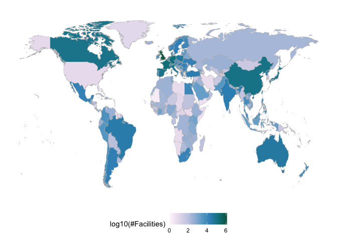
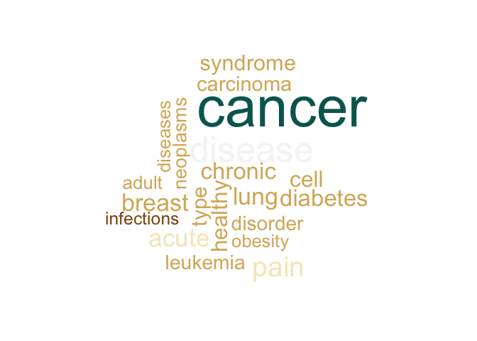

<!-- README.md is generated from README.Rmd. Please edit that file -->

# bis620.2023

<!-- badges: start -->

[](https://github.com/anranjiao/bis620.2023/actions/workflows/R-CMD-check.yaml)
[](https://github.com/anranjiao/bis620.2023/actions/workflows/test-coverage.yaml)
<!-- badges: end -->

The goal of bis620.2023 is to …

## Installation

You can install the development version of bis620.2023 from
[GitHub](https://github.com/) with:

``` r
# install.packages("devtools")
devtools::install_github("anranjiao/bis620.2023")
```

## Start the shiny app

library(bis620.2023)

startshinyapp()

## Description

This package includes a shiny app based on a dataset from clinical trial
provided by ClinicalTrials.gov. This app offers multiple functions for
users such as identifying the distribution of facilities over the world,
eligibility criteria for each study, and the types and counts of
diseases studied which help the users better understand the past
clinical trials through various ways of visualizations.

## Examples

Thses some basic examples:

``` r
library(bis620.2023)

facilities_wmap = get_facilities_wmap(facilities)
plot_facility_map(facilities_wmap)
```



``` r

library(wordcloud)
#> Loading required package: RColorBrewer
data_Feature_5 = studies |> head(1000)
word_results = get_word(data_Feature_5)
#> Warning in tm_map.SimpleCorpus(Corpus(VectorSource(condition_results$name)), :
#> transformation drops documents
#> Warning in
#> tm_map.SimpleCorpus(tm_map(Corpus(VectorSource(condition_results$name)), :
#> transformation drops documents
#> Warning in
#> tm_map.SimpleCorpus(tm_map(tm_map(Corpus(VectorSource(condition_results$name)),
#> : transformation drops documents
#> Warning in
#> tm_map.SimpleCorpus(tm_map(tm_map(tm_map(Corpus(VectorSource(condition_results$name)),
#> : transformation drops documents
wordcloud(names(word_results),
            word_results,
            scale=c(5,1),
            colors=brewer.pal(7,"BrBG"),
            max.words=20,
            min.freq = 5,)
```



## Test Coverage

[Link](https://github.com/anranjiao/bis620.2023/actions/runs/7092321828/job/19303364314)
